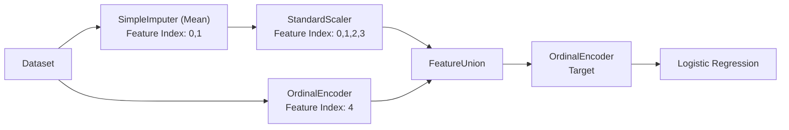

# Feature Selection using Logistic Regression

## Objective

This project demonstrates feature selection using **Logistic Regression** after preprocessing the dataset through a machine learning pipeline.

The following feature selection techniques are implemented:

- Recursive Feature Elimination (RFE)
- Sequential Feature Selection (Forward)
- Sequential Feature Selection (Backward)

---

## Preprocessing Pipeline

---

## Assignment Questions

### Question 1

> What are the two most important features computed by **Recursive Feature Elimination (RFE)**?

**Answer**

| Selected Features | Indices |
|-------------------|---------|
| V1, V3 | 0, 2 |

---

### Question 2

> What are the indices of the two most important features computed by **Sequential Feature Selection (Forward)**?

**Answer**

| Selected Features | Indices |
|-------------------|---------|
| V2, V4 | 1, 3 |

---

### Question 3

> What are the indices of the two most important features computed by **Sequential Feature Selection (Backward)**?

**Answer**

| Selected Features | Indices |
|-------------------|---------|
| V3, V4 | 2, 3 |

---

# Results

| Algorithm | Selected Features | Indices |
|-----------|-------------------|---------|
| Recursive Feature Elimination (RFE) | V1, V3 | 0, 2 |
| Sequential Feature Selection (Forward) | V2, V4 | 1, 3 |
| Sequential Feature Selection (Backward) | V3, V4 | 2, 3 |

---

# Intuition

Assume there are **5 players** (`V1`, `V2`, `V3`, `V4`, `V5`) and only **2 players** need to be selected.

### Recursive Feature Elimination (RFE)

Starts with all players and removes the weakest player based on the Logistic Regression model's feature importance until only two remain.

**Think of it as:** Removing the weakest player one by one.

---

### Sequential Feature Selection (Forward)

Starts with no players and adds the player who improves the team's performance the most at each step until two players are selected.

**Think of it as:** Building the team from scratch.

---

### Sequential Feature Selection (Backward)

Starts with all players and removes the player whose removal affects the team's performance the least until only two players remain.

**Think of it as:** Removing the player whose absence hurts the team the least.

---

# Comparison

| Algorithm | Starts With | Selection Criterion |
|-----------|-------------|---------------------|
| RFE | All features | Removes the feature with the lowest model importance (coefficient). |
| Forward SFS | No features | Adds the feature that maximizes model performance. |
| Backward SFS | All features | Removes the feature whose removal least affects model performance. |

---

# Technologies Used

- Python
- Pandas
- NumPy
- Scikit-learn
  - SimpleImputer
  - StandardScaler
  - OrdinalEncoder
  - LogisticRegression
  - Recursive Feature Elimination (RFE)
  - Sequential Feature Selector (Forward & Backward)

---

# Conclusion

Although all three methods use the same Logistic Regression estimator, they can produce different feature subsets because they follow different selection strategies:

- **RFE** removes features based on model coefficients.
- **Forward SFS** builds the feature subset by adding the most useful feature at each step.
- **Backward SFS** starts with all features and removes those whose absence has the smallest impact on model performance.

Therefore, different feature selection algorithms may identify different sets of important features on the same dataset.